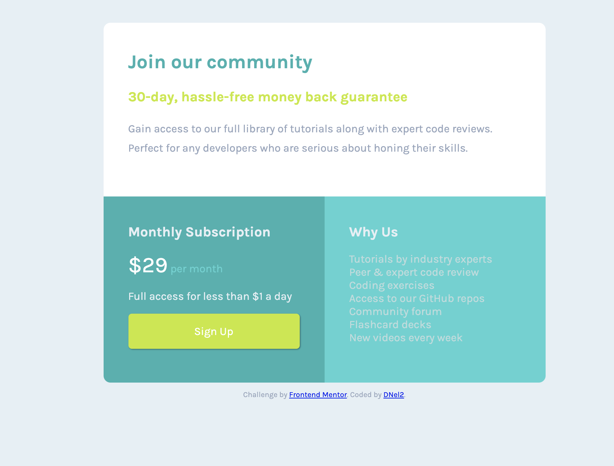
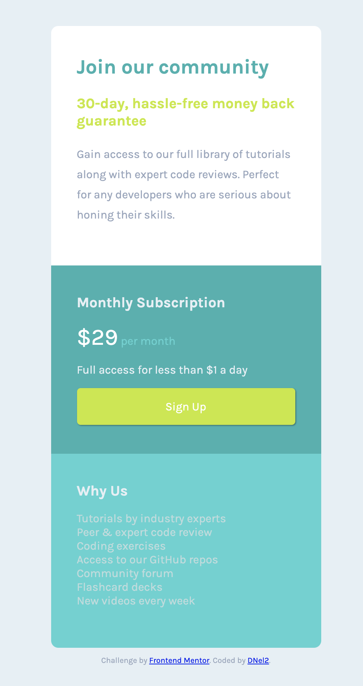

# Frontend Mentor - Single price grid component solution

This is a solution to the [Single price grid component challenge on Frontend Mentor](https://www.frontendmentor.io/challenges/single-price-grid-component-5ce41129d0ff452fec5abbbc). Frontend Mentor challenges help you improve your coding skills by building realistic projects. 

## Table of contents

- [Overview](#overview)
  - [The challenge](#the-challenge)
  - [Screenshot](#screenshot)
  - [Links](#links)
- [My process](#my-process)
  - [Built with](#built-with)
  - [What I learned](#what-i-learned)
  - [Continued development](#continued-development)
  - [Useful resources](#useful-resources)
- [Author](#author)
- [Acknowledgments](#acknowledgments)

## Overview

### The challenge

Users should be able to:

- View the optimal layout for the component depending on their device's screen size
- See a hover state on desktop for the Sign Up call-to-action

### Links
<!-- I didn't update these -->
- Solution URL: [Add solution URL here](https://your-solution-url.com)
- Live Site URL: [Add live site URL here](https://your-live-site-url.com)

### Screenshot

### Links

- Solution URL: [Solution URL here](https://github.com/TechEdDan2/SinglePriceFlexbox)
- Live Site URL: [Live site URL here](https://techeddan2.github.io/SinglePriceFlexbox/)

## My process

For this project, I started by creating the sections I thought I would need to organize the content (container, and three sub divs for the three blocks of content) and then styled it. During the styling process I set up variables.  

### Built with

- HTML
- CSS
- Flexbox

### What I learned

Since this is my second FrontEnd Mentor project, I am learning more about the process than about new HTML and CSS; however, I did use variables for the first time, which was really useful.  

### Continued development

I am new to website development, so I am hoping to get better at my workflow and general knowledge. I am also not sure if I am following best practices or the best way to style something. 

### Useful resources

- [HTML_CSS_Help] (https://developer.mozilla.org/en-US/) - MDN Docs 
- [Flexbox Help](https://css-tricks.com/snippets/css/a-guide-to-flexbox/) - This helped me with flexbox. I am sure everyone already uses this website. 

## Author

- Website - [D Nelson 2](TBD)
- Frontend Mentor - [@TechEdDan2](https://www.frontendmentor.io/profile/TechEdDan2)

## Acknowledgments
The YouTubers and other educational resources I have been learning from include: Coder Coder (Jessica Chan), BringYourOwnLaptop (Daniel Walter Scott), MDN, CSS-Tricks.  
